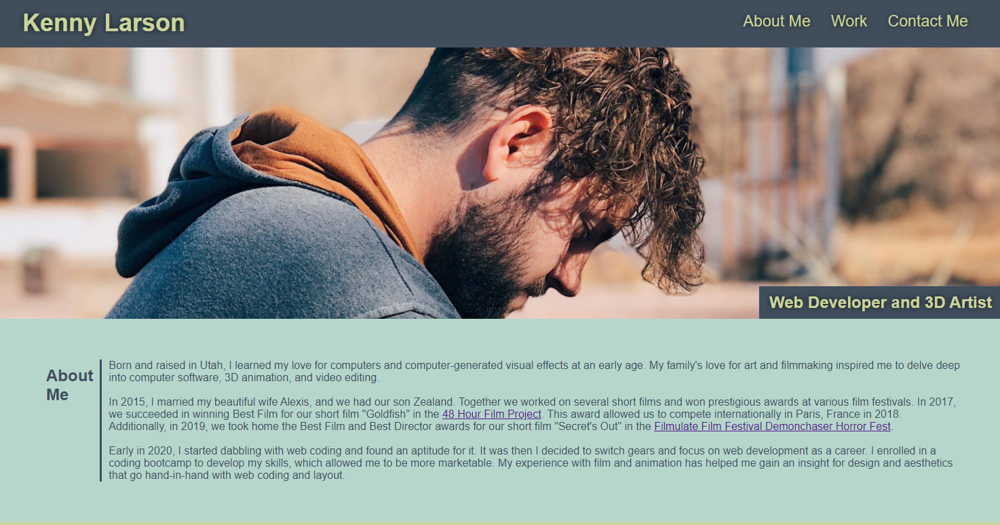

# Kenny Larson's Portfolio

  

  ## Description
  A portfolio to house my web coding, 3D art, and filmmaking showwork.

  

  ## Deployed Website

  [Kenny Larson's Portfolio](https://kenneththelarson.github.io/kenny-larson-portfolio/)

  ## Questions
  Created by: [Kenny Larson](https://github.com/kenneththelarson)
  
  For further questions please contact [kenneththelarson@gmail.com](mailto:kenneththelarson@gmail.com)

